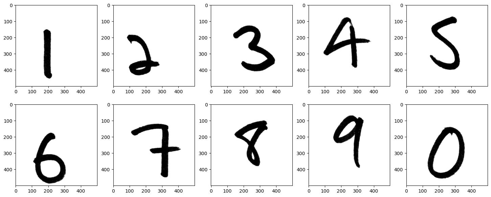
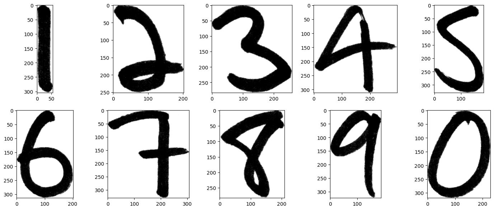

# **About**
Handwritten digits detection using a [YOLOv8](https://docs.ultralytics.com/modes/) detection model and ONNX pre/post processing.
An example of how model works in real world scenario can be viewed at **[https://thawro.github.io/web-object-detector/](https://thawro.github.io/web-object-detector/)**.

# **Data**
The dataset consists of images created with the use of a [HWD+](https://www.ncbi.nlm.nih.gov/pmc/articles/PMC9702948/) dataset.

## HWD+
The [HWD+](https://www.ncbi.nlm.nih.gov/pmc/articles/PMC9702948/) dataset consists of gray images of single handwritten digits in high resolution (500x500 pixels).

## yolo_HWD+
The `yolo_HWD+` dataset is composed of images which are produced with the use of `HWD+` dataset. Each `yolo_HWD+` image has many single digits on one image and each digit is properly annotated (*class x_center y_center width height*). The processing of `HWD+` to obtain `yolo_HWD+`:
1. Cut the digit from each image (`HWD+` images have a lot of white background around)
2. Create background image of size `imgsz` and apply transform to it (`pre_transform` attribute) - e.g. RGB shift/shuffle
3. Take `nrows * ncols` digit images and form a **nrows x ncols** grid.
4. For each digit:
   1. Apply transform (`obj_transform` attribute) - e.g. invert color, RGB shift/shuffle
   2. Randomly place the digit in *ij* cell and save its label and location as annotation. 
5. Apply transform to the fully formed grid (`post_transform` attribute) - e.g. rotation

Example below:

#### Raw digits (before any processing)

#### Cut digits (after step 1)

#### Formed grid (left) and with annotations (right)

# **Pipeline**
Each step of data pipeline is done with ONNX models. The complete pipeline during inference is the following:
1. Image preprocessing - resize and pad to match model input size ([preprocessing](models/preprocessing.onnx))
2. Object detection - Detect objects with YOLOv8 model ([yolo](models/yolo.onnx))
3. Non Maximum Supression - Apply NMS to YOLO output ([nms](models/nms.onnx))
4. Postprocessing - Apply postprocessing to filtered boxes ([postprocessing](models/postprocessing.onnx))

# **Model's results**